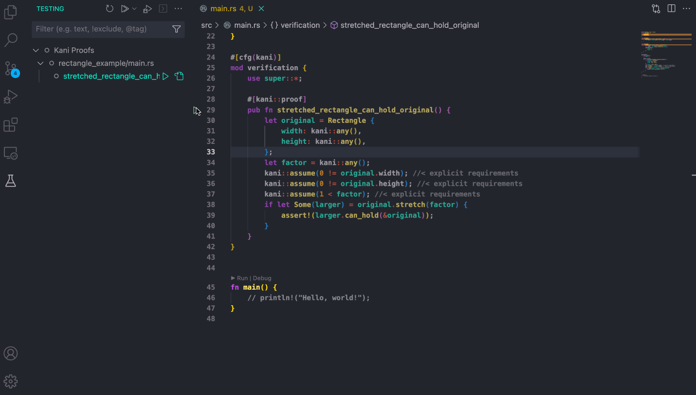
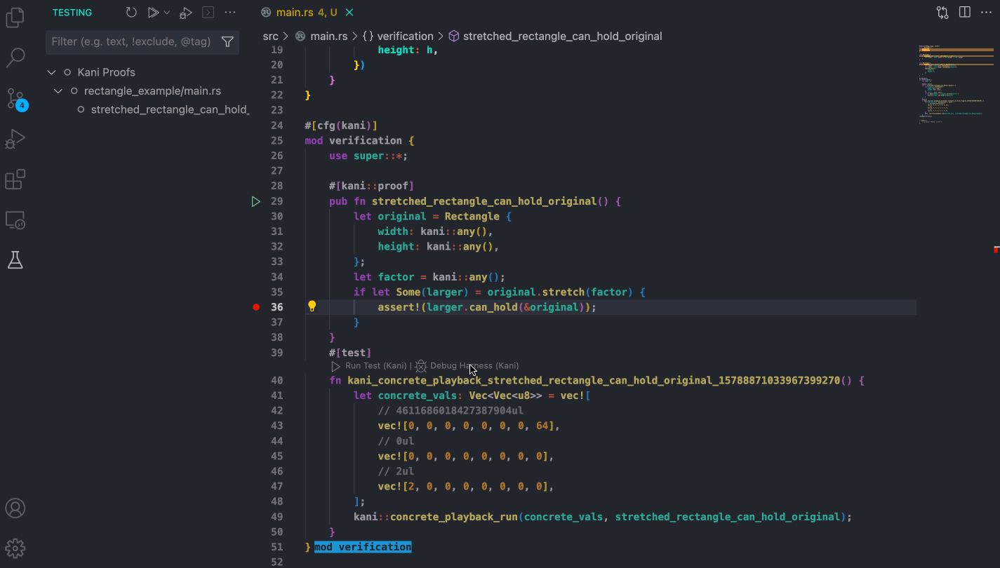
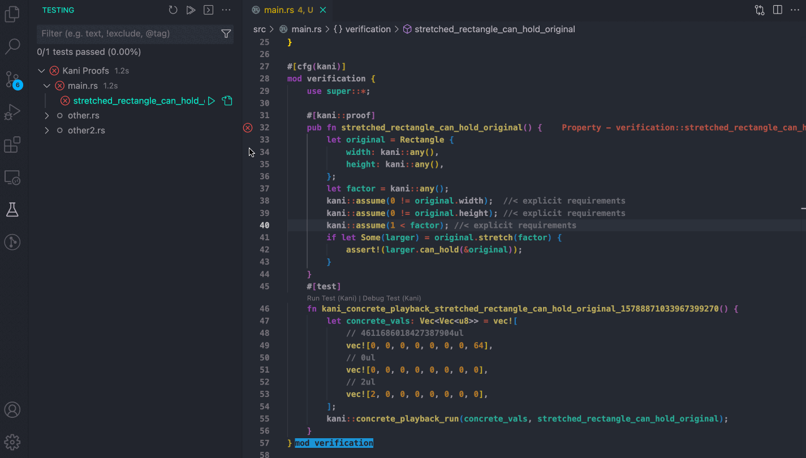

# Run and debug Rust verification harnesses natively on VS Code

Kani is a verification tool that can help you prove properties about your Rust code. To learn more about Kani, check out the [Kani tutorial](https://model-checking.github.io/kani/kani-tutorial.html) and our [previous blog posts](https://model-checking.github.io/kani-verifier-blog/).

In today’s blog post, we introduce the [Kani VS Code Extension](https://marketplace.visualstudio.com/items?itemName=model-checking.kani-vscode-extension), available on the VS Code marketplace. The extension automatically detects all harness within the project, and allows users to run and debug them directly on VS Code. To allow a more comfortable verification experience, Kani is now usable directly from the VS Code user interface. Until now, developers could only run and debug harnesses via a command-line interface.


## A Simple Example

To show some of the features in the extension, we will work through a familiar example, the rectangle example that we introduced in our [first blog post](https://model-checking.github.io/kani-verifier-blog/2022/05/04/announcing-the-kani-rust-verifier-project.html).

```
#[derive(Debug, Copy, Clone)]
struct Rectangle {
    width: u64,
    height: u64,
}

impl Rectangle {
    fn can_hold(&self, other: &Rectangle) -> bool {
        self.width > other.width && self.height > other.height
    }

    fn stretch(&self, factor: u64) -> Option<Self> {
        let w = self.width.checked_mul(factor)?;
        let h = self.height.checked_mul(factor)?;
        Some(Rectangle { width: w, height: h })
    }
}
```

In order to prove properties about the rectangle, we wrote a proof harness. The proof harness tried to prove that the rectangle can hold its original size (dimensions) even when stretched. If proven this means that, for any stretch factor given, for any height and width of the original rectangle, this property holds true.

```
#[kani::proof]
pub fn stretched_rectangle_can_hold_original() {
    let original = Rectangle { width: kani::any(), height: kani::any() };
    let factor = kani::any();
    if let Some(larger) = original.stretch(factor) {
        assert!(larger.can_hold(&original));
    }
}
```

#### How users use Kani currently

The current way of interacting with Kani is through the command line. Users invoke `cargo kani` and then mention their harness that they want to verify and this gives a text based output that tells you whether your proof has succeeded or failed.

```
$ cargo kani --harness stretched_rectangle_can_hold_original# --snip--
[rectangle::verification::stretched_rectangle_can_hold_original.assertion.1] line 86 assertion failed: larger.can_hold(&original): FAILURE
VERIFICATION FAILED
```

## Introducing the Kani VS Code Extension

Kani VS Code extension offers a hassle-free and seamless integration into Visual Studio Code, making it more convenient to write and debug proofs. As you write proof harnesses using Kani, the extension detects them and conveniently showcases them within your testing panel. The extension offers detailed diagnostics, comprehensive feedback about proof failures, error messages, and stack traces. This empowers our users to find bugs and verify their code quicker. You can install the extension from the [webpage](https://marketplace.visualstudio.com/items?itemName=model-checking.kani-vscode-extension) on VS Code marketplace or by searching for `Kani` in the extensions tab of your VS Code instance.

## Using the VS Code extension

#### How to verify a harness using the Kani VS Code extension

With the extension, running Kani on a harness to verify it, is as simple as clicking a button. The following sections walk you through the first few actions you’ll need. We’ll walk you through using the extension’s core features to debug and finally verify the rectangle example mentioned above.

#### View Kani harnesses

As soon as your rust package is opened using the Kani extension in a VS Code instance, you should see the Kani proofs loaded as regular unit tests in the Testing Panel on the left border of VS Code. This is how the testing page looks like when you click on the panel.

#### Run Kani harnesses

You can then run your harnesses using the tree view by clicking the play button beside the harness that was automatically picked up by the Kani Extension. Once you run the harness using the extension, you are shown a failure banner if the verification has failed (or a green check-mark if it’s succeeded).

In our example, as with the command line, we can see through visual markers such as the failure banner pop-up and the red failure marker, that the verification has failed.

You are then presented with two options:

1. [Generate the report for the harness](https://github.com/model-checking/kani-vscode-extension/blob/main/docs/user-guide.md#view-trace-report)
2. [Run concrete playback to generate unit tests](https://github.com/model-checking/kani-vscode-extension/blob/main/docs/user-guide.md#use-concrete-playback-to-debug-a-kani-harness).


Kani can help you generate unit tests containing the counter-example (or values for which the assertion fails). Each unit test provides inputs that will either trigger a property failure or satisfy a cover statement. This feature called [concrete playback](https://model-checking.github.io/kani-verifier-blog/2022/09/22/internship-projects-2022-concrete-playback.html) allows you to generate unit tests that call a function with the exact arguments that caused the assertion violation, and the VSCode Extension makes using concrete playback easy. You can read more about concrete playback in our [documentation](https://model-checking.github.io/kani/debugging-verification-failures.html).

#### Generate a counter-example unit test

Next, we’ll generate the unit test by clicking on the `Run Concrete Playback for stretched_rectangle_can_hold_original` link that appears through a blue link on the error banner.
[Image: generate counter example.gif]By simply clicking on a link, we have our counter example unit test pasted directly below the harness. This is what the unit test looks like:

```
#[test]
fn kani_concrete_playback_stretched_rectangle_can_hold_original() {
    let concrete_vals: Vec<Vec<u8>> = vec![
        // 4611686018427387904ul
        vec![0, 0, 0, 0, 0, 0, 0, 64],
        // 0ul
        vec![0, 0, 0, 0, 0, 0, 0, 0],
        // 2ul
        vec![2, 0, 0, 0, 0, 0, 0, 0],
    ];
    kani::concrete_playback_run(concrete_vals, stretched_rectangle_can_hold_original);
}
```

 You can see in the gif above, that the source is now annotated with two options that hover over the unit test generated called  `Run Test (Kani) | Debug Test (Kani)` which allow you to run and debug the test just like any other rust unit test.

#### Run Kani-generated test

Running the unit test using the Run Test (Kani) button, shows us what we’re expecting–that the current unit test is failing. This is because the unit test is using the counter-examples to invoke the function `stretched_rectangle_can_hold_original`.


### Debug Kani unit test

In order to peek under the hood to find out the faulty assumptions that lead to unexpected behavior, it is really important to look at the concrete counter examples for which our assertions fail. By setting breakpoints and clicking the debug test (Kani) button, you are taken into the debugger which allows you to look at the specific values for which the assertion fails.



In our case, we can see that for `original.height = 0` , the larger rectangle’s height or `larger.height` also stays 0, which shows that for that counter example, the property `can_hold`  does not hold.

### And finally, verify the harness with the right assumptions

Now that we know that for `original.width = 0`, our assertion fails, we can repeat the experiment with explicit assumptions.  The experiments should reveal that for all parameters, having a 0 value will cause the assertion to fail. Additionally, there is a problem if `factor` is `1` because in this case stretch will return `Some(...)` but the stretched rectangle will be the same size as the original. We missed these cases in our unit and property-based tests.

We will now add these assumptions through `Kani::assume` and re-run the verification in the extension.

And with that green check-mark, you can be assured that the harness has been verified!


## Wrapping up

You can use Kani natively in VS Code using the Kani VS Code extension, [available on the marketplace](https://marketplace.visualstudio.com/items?itemName=model-checking.kani-vscode-extension) now. By using the power of VS Code and its debugging capabilities, the Kani extension allows developers to use Kani to verify rust code without leaving the editor interface.

The Kani extension has more features which weren’t mentioned in the blog, that you can read about in our [user guide documentation](https://github.com/model-checking/kani-vscode-extension/blob/main/docs/user-guide.md). If you are running into issues with the Kani extension or have feature requests or suggestions, we’d [love to hear from you](https://github.com/model-checking/kani-vscode-extension/issues).
